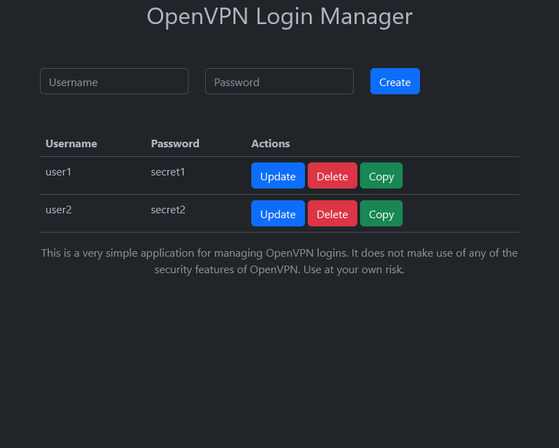

This is a little web frontend that I wrote for managing low security logins to an OpenVPN layer 2 tunnel for playing LAN games. This project is build for easy of use. It stores passwords in plain text, has no authentication but it does however make it trivial to distribute logins. It can also be used to manage logins for other services.

# Features
* Stores passwords in plain text(!!) in an actual `text/plain` file. (I heard you like plaintext...)
* Management of users (create, delete, update).
* Copy button which will copy a preformatted message into clipboard, ready to be send to friends.
* No access control. You need to bring your own.
* Looks janky as shit.
* Comes with a script to use with OpenVPN for validating logins.

* Even has a Docker image.

# Demo
(Usually outdated)


# Configuration
The following options can be passed via environment variables:

| Variable | Description | Default |
| -------- | ----------- | ------- |
| `LOGIN_FILE_PATH` | Path to the file where the logins are stored. | `/data/logins.txt` |
| `FILE_PERMISSIONS` | Permissions of the login file. | `0644` |
| `PAGE_TITLE` | Title of the page. | `Simple` |

# Using `docker-compose` with OpenVPN
When using docker-compose it will look something like this:
```yaml
version: "3.9"

services:
  openvpn:
    # some openvpn image
    # you also need to get the check-login.sh into the container
    image: "..."
    cap_add:
      - NET_ADMIN
    environment:
      # ...
    ports:
      # ...
    volumes:
      - "keys:/etc/openvpn/keys"
      - "logins:/data:ro"

  webpanel:
    image: "ghcr.io/chrisliebaer/simple-openvpn-web:master"
    restart: "always"
    environment:
      - "PAGE_TITLE=Simple VPN"
      # Usefull since OpenVPN will drop privileges to nobody:nogroup
      - "FILE_PERMISSIONS=644"
    volumes:
      - "logins:/data"
    labels:
      - "traefik.enable=true"
      - "traefik.http.services.simple-openvpn-web.loadbalancer.server.port=8080"
      - "traefik.http.routers.simple-openvpn-web.rule=Host(`vpn.example.com`)"
      - "traefik.http.routers.simple-openvpn-web.entryPoints=web"
      - "traefik.http.routers.simple-openvpn-web.middlewares=myauth"


volumes:
  keys:
  logins:
```